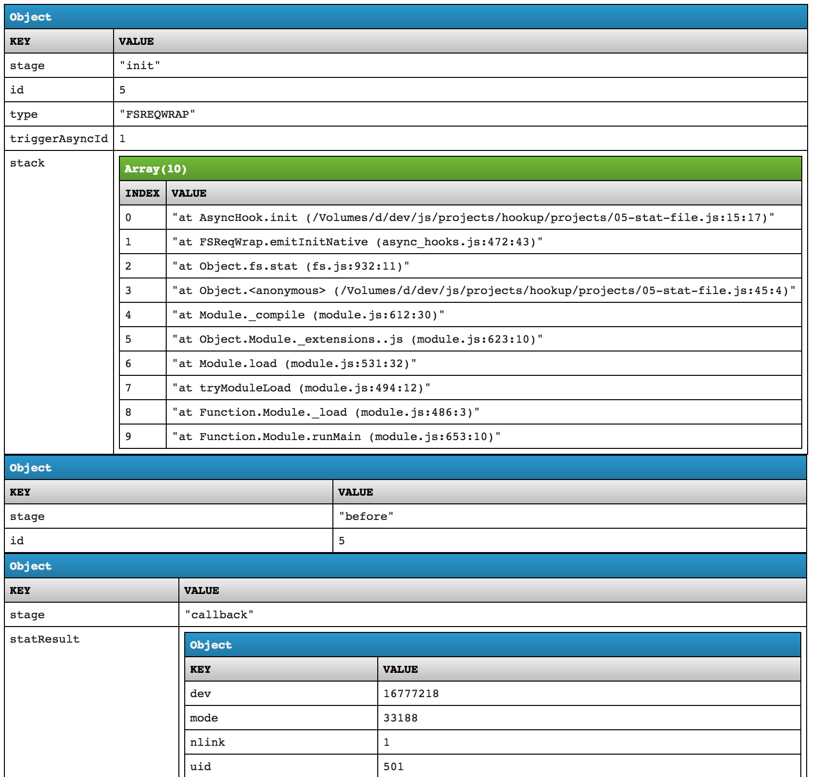

# hookup

Get hooked up with async-hooks to gain insight into your Node.js applications.

<!-- START doctoc generated TOC please keep comment here to allow auto update -->
<!-- DON'T EDIT THIS SECTION, INSTEAD RE-RUN doctoc TO UPDATE -->
**Table of Contents**  *generated with [DocToc](https://github.com/thlorenz/doctoc)*

- [Getting Started](#getting-started)
- [Running an Exercise](#running-an-exercise)
  - [Changing the Output Format](#changing-the-output-format)
    - [HTML](#html)
    - [JSON](#json)
- [Inspecting an Exercise](#inspecting-an-exercise)

<!-- END doctoc generated TOC please keep comment here to allow auto update -->



## Getting Started

```sh
git clone https://github.com/thlorenz/hookup
cd hookup && npm install
```

## Running an Exercise

npm scripts to run exercises have been provided in order to ensure you are running them with **Node.js version 8 or higher**. This
is necessary to ensure the _async-hooks_ feature is available.

To run an exercise use the `test` script, i.e. for the first exercise do:

```sh
npm test exercises/01-init.timer.js
```

Alternatively (if you're sure that your Node.js version is current enough -- check via `node -v`) you can just run the
exercises directly with your `node` executable.

```sh
node exercises/01-init.timer.js
```

### Changing the Output Format

By default all data is output to the console, but for all exercises but the first one you can change that to either html
or JSON (I personally find the html result most readable).

#### HTML

To produce an html file do one of the following:

```sh
npm run html exercises/02-init.timer-enable-late.js
```

or

```sh
node exercises/02-init.timer-enable-late.js --html
```

Then open `./result.html` in your browser of choice.

#### JSON

To produce a json file do one of the following:

```sh
npm run json exercises/02-init.timer-enable-late.js
```

or

```sh
node exercises/02-init.timer-enable-late.js --json
```

Then open `./result.json` in your editor of choice.

## Inspecting an Exercise

If you're having trouble or just are interested in how things work under the hood, you can run each exercise in _inspect_
mode as follows.

```sh
npm run inspect exercises/01-init.timer.js
```

or, using your executable

```sh
node --inspect-brk exercises/01-init.timer.js
```

For more information please read [these docs](https://nodejs.org/en/docs/inspector).

I also encourage you to launch Chrome DevTools in any tab and look for the Node.js icon in the upper left corner ;).
That allows you to launch a dedicated DevTools for Node.js.
